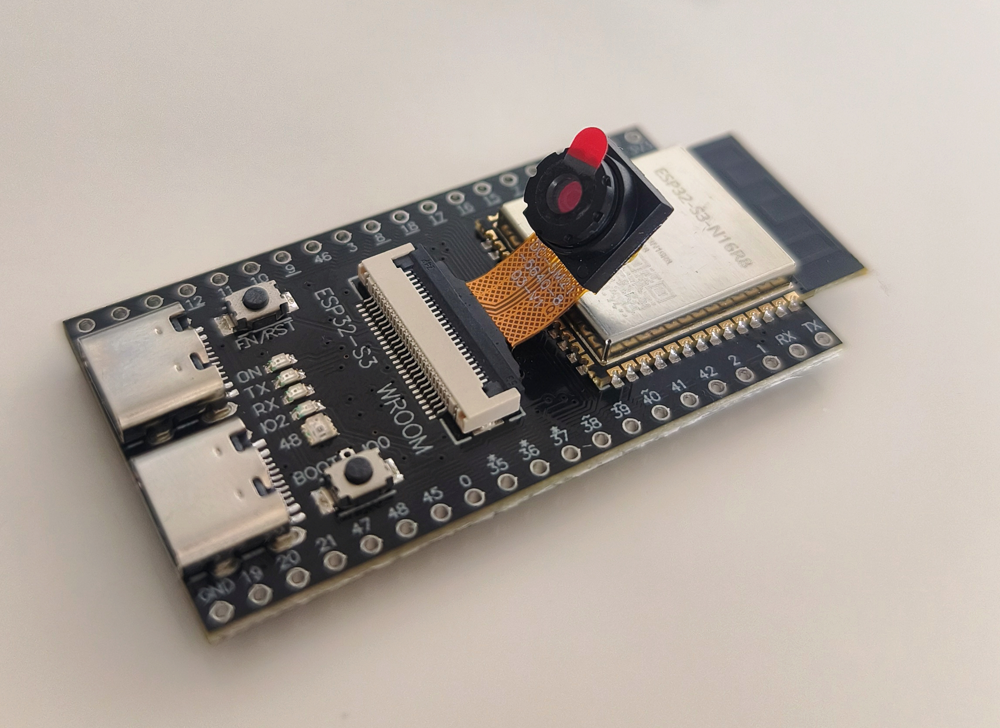

[Español](./README_ESP.md) - [English](./README.md)

# ESP32-S3 CAM - Proyecto de Cámara con Servidor Web

Este proyecto implementa un firmware para el módulo ESP32-S3 CAM que incluye un servidor web integrado para control y visualización de la cámara.

## Características

- **Tema oscuro**: Todas las interfaces web tienen un tema oscuro como se solicitó
- **Control de LED RGB**: El LED del pin 48 indica el estado del dispositivo:
  - Púrpura: Estado inicial
  - Azul: Modo AP (Access Point)
  - Verde: Modo Station (conectado a WiFi)
  - Blanco: Transmitiendo video
  - Rojo: Error
- **Modo AP para configuración**: Si no hay credenciales guardadas o no se puede conectar, el ESP32 crea su propia red WiFi para configuración
- **Streaming de video en tiempo real**: Visualización de la cámara en tiempo real a través del navegador
- **Interfaz de configuración**: Página web para ajustar parámetros de la cámara con previsualización en tiempo real
- **Información del hardware**: La interfaz de configuración muestra detalles técnicos del hardware de la cámara

## Instalación

1. Asegúrate de tener MicroPython instalado en tu ESP32-S3 CAM
2. Copia todos los archivos del proyecto a la memoria del ESP32-S3 CAM:
   - `main.py`
   - `led_controller.py`
   - `wifi_manager.py`
   - `video_server.py`
   - `camera_config_server.py`
3. Reinicia el dispositivo

## Uso

1. Al iniciar, el dispositivo intentará conectarse a una red WiFi con credenciales guardadas
2. Si no hay credenciales guardadas o no puede conectarse, iniciará en modo AP
3. En modo AP, puedes conectarte a la red "ESP32-CAM-Setup" y acceder a la configuración web en la IP del dispositivo
4. Una vez conectado a WiFi, puedes acceder a la vista en vivo en la IP del dispositivo
5. Para acceder a la configuración de la cámara, visita IP/cam

## Archivos del Proyecto

- `main.py`: Archivo principal que integra todos los módulos
- `led_controller.py`: Controlador del LED RGB con códigos de estado
- `wifi_manager.py`: Gestor de conexión WiFi con modo AP para configuración
- `video_server.py`: Servidor web para streaming de video en tiempo real
- `camera_config_server.py`: Servidor web para la interfaz de configuración de la cámara
- `README.md`: Documentación del proyecto
- `PLAN.md`: Plan detallado del proyecto
- `Changelog.md`: Historial de cambios del proyecto

## Configuración de Cámara

La interfaz de configuración permite ajustar:

- Calidad y resolución de imagen
- Brillo, contraste y saturación
- Efectos especiales
- Balance de blanco
- Nivel de exposición
- Orientación (espejo horizontal y volteo vertical)

## Posibles Mejoras Futuras (TODOlist)

- Añadir autenticación para proteger las interfaces web
- Implementar grabación de video y almacenamiento en tarjeta SD
- Añadir detección de movimiento y notificaciones
- Implementar control remoto mediante comandos API
- Añadir funcionalidad de seguimiento de objetos
- Incorporar reconocimiento de rostros
- Desarrollar aplicación móvil para control remoto
- Implementar streaming a múltiples clientes simultáneamente
- Añadir funcionalidad de timbre inteligente con notificaciones
- Crear sistema de alertas basado en IA
- Implementar compresión de video para reducir ancho de banda
- Añadir soporte para múltiples cámaras
- Integrar con servicios de nube para almacenamiento remoto

## Licencia

Este proyecto está desarrollado con fines educativos y de aprendizaje. Se distribuye bajo la MIT License.